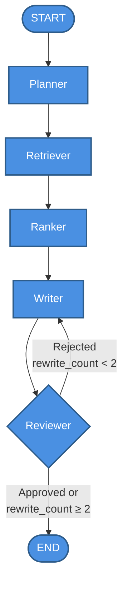

# Technical Report: Sports news Agentic AI

Thực hiện: Phan Văn Hoàng
Điện thoại: 0335059497
Email: phanhoang03505@gmail.com

## 1. Tổng Quan Hệ Thống

Sports news Agentic AI là một hệ thống tự động thu thập, xử lý và tổng hợp tin tức thể thao từ các nguồn báo điện tử Việt Nam trong vòng 7 ngày gần nhất, sau đó tạo ra một báo cáo tuần dạng Markdown và gửi qua email. Hệ thống được xây dựng theo kiến trúc multi-agent pipeline, trong đó mỗi agent đảm nhận một vai trò chuyên biệt và được quản lý bởi LangGraph. 

Điểm khởi đầu của toàn bộ luồng xử lý là một HTTP POST request đến endpoint `/generate-report` hoặc một cron job tự động chạy vào mỗi thứ Hai lúc 08:00 giờ Việt Nam. Điểm kết thúc là một file `outputs/weekly_report.md` được ghi ra đĩa và một email HTML được gửi đến danh sách người nhận đã cấu hình.

## 2. Công Nghệ Sử Dụng  

### 2.1 Framework và Thư Viện Chính  
- **FastAPI**: framework web để expose REST API
- **LangGraph**: (tương thích 0.4.x) giúp xây dựng state machine cho multi-agent pipeline
- LangChain + langchain-groq (0.3.x): wrapper để gọi Groq LLM thông qua LangChain interface
- Google GenAI SDK (google-genai, 1.x): gọi Gemini Embedding API để tạo vector embedding.
- **FAISS**: thư viện tìm kiếm vector similarity của Facebook AI, dùng để index và truy vấn embedding
- BeautifulSoup4 + Requests: thu thập và parse HTML từ các trang báo.
- Pydantic: định nghĩa và validate schema dữ liệu.
### 2.2 Mô Hình AI Sử Dụng
- Embedding Model: `models/gemini-embedding-2-preview Embedding được cache trong cột `embedding` của bảng PostgreSQL để tránh gọi API lại cho các bài báo đã xử lý ở lần chạy trước.
- Model LLM: `llama-3.1-8b-instant` chạy trên hạ tầng Groq. Model này được dùng cho tất cả bốn agent trong pipeline: Planner, Ranker, Writer và Reviewer.
### 2.3 Môi Trường Chạy
Ứng dụng Docker và Docker Compose với hai service:
- Service `db` dùng image `postgres:15`, lưu dữ liệu vào volume `pgdata`, expose port 5432
- Service `agent` được build từ `Dockerfile` dùng base image `python:3.11-slim`, cài dependencies từ `requirements.txt`, expose port 8000, và mount hai volume: `./data` cho FAISS index và `./outputs` cho file báo cáo.

## 3. Cấu Trúc Dữ Liệu
Toàn bộ dữ liệu trong pipeline được định nghĩa trong `models/schemas.py` bằng Pydantic.

### ArticleSchema
Đại diện cho một bài báo đã thu thập. Các trường bao gồm: 
- `id` (int, tùy chọn).
- `title` (str).
- `content` (str).
- `source` (str, tối đa 100 ký tự).
- `url` (str).
- `published_at` (datetime).
- `category` (str).
- `created_at` (datetime, tùy chọn).
- `embedding` (list[float], tùy chọn, lưu cache embedding từ DB).

### PlanSchema
Kế hoạch do Planner agent tạo ra. Các trường: 
- `date_range` (str, khoảng thời gian tuần).
- `sub_goals` (list[str], danh sách mục tiêu con).
- `corpus_summary` (str, tóm tắt ngắn về tập bài báo.

### HighlightedNewsItem

Một tin tức nổi bật trong báo cáo. Các trường: 
- `headline` (str).
- `summary` (str).
- `source` (str).
- `url` (str).
### ReportSchema

Cấu trúc báo cáo hoàn chỉnh. Các trường: 
- `executive_summary` (str, 4 đoạn văn tiếng Việt).
- `trending_keywords` (list[str]).
- `highlighted_news` (list[HighlightedNewsItem]).
- `generated_at` (datetime).

### ReportState (TypedDict)

State được truyền qua toàn bộ LangGraph pipeline. Các trường: 
- `articles`, `plan`, `retrieved_articles`, `ranked_articles`, `report`, `review_status`, `rewrite_count`, `error`.
## 4. Implementation Workflow
### Bước 0: Start
Khi người dùng gọi `POST /generate-report` hoặc scheduler kích hoạt, hàm `run_pipeline()` trong `graph.py` được gọi. Đây là hàm bootstrap toàn bộ hệ thống trước khi chạy LangGraph.
### Bước 1: Crawling
Hàm `crawl_all_sources()` trong `tools/crawler.py` lần lượt gọi ba hàm crawler:
- `crawl_vnexpress()`: thu thập từ `https://vnexpress.net/the-thao`, nhận diện bài báo qua pattern URL `https://vnexpress.net/[slug]-[7 chữ số].html`.
- `crawl_thanhnien()`: thu thập từ `https://thanhnien.vn/the-thao/`, nhận diện bài báo qua pattern `-185[15 chữ số].htm`.
- `crawl_tuoitre()`: thu thập từ `https://tuoitre.vn/the-thao.htm`, nhận diện bài báo qua pattern `-202[14 chữ số].htm`.

Mỗi crawler gọi hàm nội bộ `_crawl_source()` với các tham số: URL trang chuyên mục, regex pattern nhận diện bài báo, tên nguồn, và base URL. Hàm này thực hiện:
1. Gọi `_get(section_url)` để tải trang chuyên mục.
2. Parse HTML bằng BeautifulSoup, tìm tất cả thẻ `<a>` có href khớp pattern.
3. Lọc trùng URL, giới hạn tối đa 20 bài để crawl chi tiết.
4. Với mỗi bài, gọi `_get(article_url)` để tải nội dung.
5. Gọi `_parse_date_meta()` để trích xuất ngày đăng từ meta tag `article:published_time`, span class `date`, hoặc thẻ `<time>`.
6. Lọc bài có `published_at` cũ hơn 7 ngày.
7. Gọi `_extract_content()` để trích xuất nội dung bài báo từ các container HTML phổ biến (class `fck_detail`, `article-body`, `detail-content`, `article__body`, hoặc attribute `itemprop="articleBody"`).
8. Tạo đối tượng `ArticleSchema` và thêm vào danh sách kết quả.

  
Input: không có tham số, đọc từ các URL cố định.

Output: `list[ArticleSchema]`.
  

### Bước 2: Làm Sạch Nội Dung
  
Hàm `clean_text(text: str) -> str` trong `tools/preprocess.py` được gọi cho từng bài báo:

1. Parse HTML bằng BeautifulSoup để loại bỏ thẻ HTML.

2. Xóa ký tự `<` và `>` còn sót.

3. Dùng regex `\s+` để chuẩn hóa khoảng trắng về một dấu cách.

4. Strip đầu cuối chuỗi.
  

### Bước 3: Lọc và Loại Trùng
 
Hai hàm trong `tools/preprocess.py`:
- `filter_recent_articles(articles)`: giữ lại bài có `published_at >= now - 7 days` và `category == "sports"`.
- `deduplicate_articles(articles)`: loại bỏ bài trùng URL, sau đó loại bỏ bài trùng tiêu đề, giữ lại lần xuất hiện đầu tiên.  

### Bước 4: Lưu vào PostgreSQL 

Hàm `save_articles(articles, engine)` trong `tools/db.py` thực hiện bulk insert vào bảng `news_articles` bằng PostgreSQL `INSERT ... ON CONFLICT DO NOTHING` trên cột `url`. Bảng có các cột: `id`, `title`, `content`, `source`, `url`, `published_at`, `category`, `created_at`, `embedding`. 

### Bước 5: Tải Lại từ DB  
Hàm `get_articles_last_7_days(engine)` truy vấn toàn bộ bài báo trong 7 ngày gần nhất, bao gồm cả trường `embedding` đã cache. Kết quả được sắp xếp theo `published_at DESC`.

### Bước 6: Tạo Embedding và Xây Dựng FAISS Index

Hàm `embed_articles(articles)` trong `tools/embeddings.py`:


1. Kiểm tra từng bài xem đã có embedding cache trong DB chưa (trường `embedding` là list float hợp lệ).

2. Với bài chưa có embedding, gọi `_embed_batch(texts)` theo batch 5 bài một lần.

3. `_embed_batch()` gọi `client.models.embed_content()` của Google GenAI SDK với `task_type="RETRIEVAL_DOCUMENT"`, có cơ chế retry exponential backoff khi gặp lỗi rate limit 429.

4. Lưu embedding mới vào DB qua `save_embeddings()`.

5. Trả về `np.ndarray` shape `(N, D)` với D là số chiều embedding.


Hàm `build_faiss_index(embeddings)` tạo `faiss.IndexFlatL2`, thêm toàn bộ vector, và ghi ra file `data/faiss.index`.

  
### Bước 7: Chạy LangGraph Pipeline
## Chi tiết các Agent

| Agent         | Mô tả                                    |
| ------------- | ---------------------------------------- |
| **Planner**   | Lập kế hoạch tin tức thể thao cần report |
| **Retriever** | Truy xuất dữ liệu tin tức từ các nguồn   |
| **Ranker**    | Xếp hạng tin tức theo độ quan trọng      |
| **Writer**    | Viết báo cáo tin tức thể thao            |
| **Reviewer**  | Kiểm duyệt chất lượng nội dung           |





## 5. Chi Tiết Từng Agent

### 5.1 Planner Agent (agents/planner.py) 

Hàm: `planner_node(state: ReportState) -> ReportState` 

Mục đích: tạo kế hoạch có cấu trúc cho báo cáo tuần. 

Cách hoạt động:

1. Trích xuất danh sách nguồn và số lượng bài từ `state["articles"]`.

2. Tính khoảng thời gian tuần hiện tại bằng `_get_week_date_range()`.

3. Xây dựng prompt yêu cầu LLM trả về JSON với ba trường: `date_range`, `sub_goals`, `corpus_summary`.

4. Gọi `ChatGroq.invoke(prompt)`.

5. Parse JSON từ response, strip markdown code fence nếu có.

6. Gọi `_ensure_required_sub_goals()` để đảm bảo bốn mục tiêu bắt buộc luôn có mặt: "retrieve relevant stories", "identify trending topics", "summarize findings", "review report quality".

7. Tạo `PlanSchema` và gán vào `state["plan"]`.

  

Input state: `articles` (list[ArticleSchema]).

Output state: thêm `plan` (PlanSchema).

  
### 5.2 Retriever Agent (agents/retriever.py)

Hàm: `retriever_node(state: ReportState) -> ReportState`
Mục đích: dùng FAISS để pre-filter tối đa 30 bài liên quan nhất trước khi đưa vào Ranker.
  
Cách hoạt động:
1. Xây dựng danh sách query từ `plan.sub_goals` kết hợp với bốn topic bắt buộc: "sports highlights of the week", "football top news", "Vietnam sports achievements", "international sports trends".

2. Load FAISS index từ disk bằng `load_faiss_index()`.

3. Với mỗi query, gọi `embed_query(query)` để tạo vector query với `task_type="RETRIEVAL_QUERY"`, sau đó gọi `index.search(query_vec, k)` để lấy top-k indices.

4. Deduplicate kết quả theo URL, giới hạn tổng số bài là `RETRIEVER_MAX=30`.

5. Đảm bảo đa dạng nguồn: nếu có nguồn nào chưa có bài trong kết quả, thêm ít nhất một bài từ nguồn đó.

  
Input state: `articles`, `plan`.

Output state: thêm `retrieved_articles` (list[ArticleSchema], tối đa 30 bài).

### 5.3 Ranker Agent (agents/ranker.py)

Hàm: `ranker_node(state: ReportState) -> ReportState` 

Mục đích: dùng LLM để chọn ra `TOP_N=8` bài có giá trị tin tức cao nhất.

Cách hoạt động:

1. Nếu số bài đã nhỏ hơn hoặc bằng 8, bỏ qua LLM call và trả về nguyên danh sách.

2. Xây dựng danh sách ứng viên dạng text: `[index] (source) title. first_sentence[:150]`.

3. Gọi LLM với prompt yêu cầu chọn đúng 8 index, đảm bảo ít nhất 2 bài từ mỗi nguồn có mặt.

4. Parse JSON array từ response bằng regex `\[[\d,\s]+\]`.

5. Nếu LLM trả về ít hơn 8 index hợp lệ, bổ sung thêm từ danh sách gốc.

6. Fallback: nếu LLM call thất bại, lấy 8 bài đầu tiên từ `retrieved_articles`.

Input state: `retrieved_articles`.

Output state: thêm `ranked_articles` (list[ArticleSchema], tối đa 8 bài).

### 5.4 Writer Agent (agents/writer.py) 

Hàm: `writer_node(state: ReportState) -> ReportState` 

Mục đích: sinh báo cáo hoàn chỉnh bằng hai LLM call riêng biệt, sau đó ghi ra file Markdown. 

Cách hoạt động:

LLM Call 1 - Tổng quan và từ khóa:
- Hàm `_build_summary_prompt(articles)` tạo prompt yêu cầu viết `executive_summary` (4 đoạn văn tiếng Việt, mỗi đoạn phân tích một chủ đề khác nhau) và `trending_keywords` (8-12 từ khóa).
- Gọi `ChatGroq.invoke(summary_prompt)`.
- Parse JSON, kiểm tra `executive_summary` không rỗng.


LLM Call 2 - Tin tức nổi bật:
- Hàm `_build_news_prompt(articles)` tạo prompt yêu cầu viết một JSON array, mỗi phần tử có `headline`, `summary`, `source`, `url`.
- Gọi `ChatGroq.invoke(news_prompt)` với tối đa 2 lần retry nếu parse JSON thất bại.
  
Sau khi có đủ dữ liệu:
- Tạo `ReportSchema` với `generated_at` theo múi giờ GMT+7.
- Gọi `_build_markdown(report)` để chuyển đổi sang Markdown.
- Ghi file ra `outputs/weekly_report.md` (hoặc đường dẫn từ biến môi trường `REPORT_OUTPUT_PATH`).
- Gán `state["report"] = report`.
- Tăng `state["rewrite_count"]` lên 1.  

Hàm `_build_markdown(report: ReportSchema) -> str` tạo cấu trúc Markdown với các section: tiêu đề, ngày tạo, Tổng Quan (executive_summary), Từ Khóa Nổi Bật (trending_keywords dạng bullet list), Tin Tức Nổi Bật (mỗi tin là một subsection H3 với summary, nguồn, URL).


Input state: `ranked_articles` (hoặc `retrieved_articles` nếu ranked rỗng).

Output state: thêm `report` (ReportSchema), file `weekly_report.md` được ghi ra đĩa.
  
### 5.5 Reviewer Agent (agents/reviewer.py)
  
Hàm: `reviewer_node(state: ReportState) -> ReportState`
Mục đích: đánh giá chất lượng báo cáo theo 10 tiêu chí, quyết định approved hoặc rejected.  

Cách hoạt động:
1. Hàm `_build_prompt(state)` xây dựng prompt đánh giá với 10 tiêu chí: tính đầy đủ, căn cứ thực tế, giọng văn chuyên nghiệp, đủ ba section, toàn bộ nội dung bằng tiếng Việt, tính nhất quán giữa các section, chiều sâu phân tích, không lặp lại giữa đoạn 1 và đoạn 4 của executive_summary, đúng nguồn, không dùng từ khóa quá chung chung.

2. Kiểm tra deterministic trước khi gọi LLM: nếu `trending_keywords` chứa các từ quá chung như "thể thao", "bóng đá", "tin tức", thêm cảnh báo vào prompt.

3. Gọi `ChatGroq.invoke(prompt)`.

4. Parse JSON response, lấy `status` ("approved" hoặc "rejected") và `reason`.

5. Gán `state["review_status"] = status`.

6. Nếu LLM call thất bại, mặc định approve để không block pipeline.

  
Hàm `should_rewrite(state: ReportState) -> str` là conditional edge function:
- Trả về `"writer"` nếu `review_status == "rejected"` và `rewrite_count < 2`.
- Trả về `"end"` trong tất cả trường hợp còn lại (approved, hoặc đã rewrite 2 lần).
  
Input state: `report`, `ranked_articles`.
Output state: cập nhật `review_status`.

## 6. Kỹ Thuật Prompt Engineering

### 6.1 Task Decomposition  
Writer Agent tách thành hai LLM call riêng biệt thay vì một call duy nhất. Call 1 sinh executive summary và trending keywords, call 2 sinh highlighted news items. Việc tách này giảm độ phức tạp của mỗi prompt, giúp model tập trung vào một nhiệm vụ cụ thể và tăng đáng kể tỷ lệ parse JSON thành công so với việc yêu cầu model sinh toàn bộ báo cáo trong một lần.

### 6.2 Anti-Repetition Rules
  Writer Agent có section "ANTI-REPETITION RULES (strictly enforced)" với ba quy tắc negative constraint: mỗi đoạn phải cover chủ đề khác nhau, đoạn 4 không được lặp lại theme của đoạn 1, không lặp lại ý tưởng hoặc cụm từ giữa các đoạn. Reviewer Agent kiểm tra lại constraint này bằng cách trích xuất đoạn 1 và đoạn 4 rồi inject trực tiếp vào prompt để LLM so sánh, tạo thành vòng kiểm tra khép kín giữa Writer và Reviewer.
  
### 6.3 Data Injection vào Evaluation Prompt 
Reviewer Agent inject dữ liệu thực tế vào prompt để LLM đánh giá thay vì chỉ mô tả tiêu chí chung. Tiêu chí kiểm tra repetition inject trực tiếp nội dung đoạn 1 và đoạn 4. Tiêu chí kiểm tra source coverage inject danh sách expected sources từ corpus. Cách này buộc model đánh giá dựa trên bằng chứng cụ thể thay vì phán đoán chung chung, tăng độ chính xác của quyết định approved/rejected.

## 7. Cấu Trúc File Output (weekly_report.md)

File Markdown đầu ra có cấu trúc cố định:

```

# Báo Cáo Thể Thao Tuần

*Ngày tạo: DD/MM/YYYY HH:MM (GMT+7)* 

--- 
## Tổng Quan  
[Đoạn 1: Bức tranh tổng thể thể thao tuần]  
[Đoạn 2: Xu hướng nổi bật nhất]
[Đoạn 3: Sự kiện lớn thứ hai]
[Đoạn 4: Nhận định và triển vọng]
---

## Từ Khóa Nổi Bật 
- [từ khóa 1]
- [từ khóa 2]
...
---

## Tin Tức Nổi Bật 

### [Tiêu đề tin 1]
[Tóm tắt 2 câu]
**Nguồn:** [tên nguồn]
**URL:** [đường dẫn bài báo] 

### [Tiêu đề tin 2]
...

```

## 8. Gửi Email
  
Sau khi pipeline hoàn thành, hàm `send_report_email(report_markdown)` trong `tools/email_sender.py` được gọi:
  
1. Đọc cấu hình SMTP từ biến môi trường: `SMTP_HOST`, `SMTP_PORT`, `SMTP_USER`, `SMTP_PASSWORD`, `EMAIL_SENDER`, `EMAIL_RECIPIENTS`.
2. Gọi `_markdown_to_html(markdown)` để chuyển đổi Markdown sang HTML cơ bản (xử lý heading, list, bold, italic, link, line break).
3. Tạo `MIMEMultipart("alternative")` với hai phần: plain text (Markdown gốc) và HTML.
4. Kết nối SMTP với `starttls()`, đăng nhập và gửi email.
## 9. Lên Lịch Tự Động

Khi ứng dụng FastAPI khởi động, hàm `start_scheduler()` đăng ký một cron job với APScheduler:
 
- Mặc định: mỗi thứ Hai lúc 08:00 giờ Việt Nam (Asia/Ho_Chi_Minh).
- Có thể tùy chỉnh qua biến môi trường: `SCHEDULE_DAY_OF_WEEK`, `SCHEDULE_HOUR`, `SCHEDULE_MINUTE`.
- Job gọi `scheduled_report_job()`, hàm này chạy `run_pipeline()` rồi đọc file Markdown đã ghi và gọi `send_report_email()`.

## 10. Kết Quả Đạt Được

Hệ thống thực thi `run_pipeline()` và tạo ra file `outputs/weekly_report.md` với nội dung tiếng Việt bao gồm ba phần chính. Phần Tổng Quan gồm bốn đoạn văn phân tích bức tranh thể thao tuần, mỗi đoạn tập trung vào một chủ đề khác nhau để tránh lặp lại. Phần Từ Khóa Nổi Bật liệt kê 8 đến 12 từ khóa đặc thù của tuần. Phần Tin Tức Nổi Bật trình bày 8 bài báo được chọn lọc từ ba nguồn VnExpress, Thanh Niên và Tuổi Trẻ, mỗi bài có tiêu đề, tóm tắt hai câu, tên nguồn và URL gốc.

Về mặt kiến trúc, hệ thống áp dụng **multi-agent** pipeline với mỗi agent đảm nhận một trách nhiệm đơn lẻ (Single Responsibility), giúp từng thành phần dễ bảo trì và mở rộng độc lập. Vòng lặp Writer → Reviewer với tối đa **2 lần rewrite** tạo cơ chế tự kiểm soát chất lượng đầu ra mà không cần can thiệp thủ công.  

Về hiệu suất, **FAISS IndexFlatL2** cho phép tìm kiếm vector similarity nhanh trên toàn bộ corpus mà không cần gọi LLM, giúp bước Retriever hoạt động hiệu quả ngay cả khi số lượng bài báo lớn. **Ranker** bỏ qua LLM call khi số bài đã nhỏ hơn hoặc bằng 8, tránh lãng phí token cho trường hợp không cần thiết. Writer tách thành **hai LLM call** riêng biệt thay vì một call duy nhất, giảm độ phức tạp mỗi prompt và tăng tỷ lệ parse JSON thành công, hạn chế retry không cần thiết.


